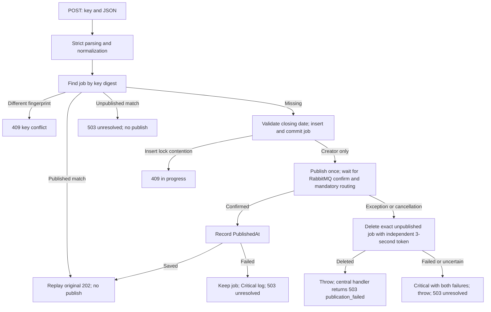

# POST workflow and compensation (Stage 6)

POST `/api/jobs` accepts UTF-8 `application/json` with one required `Idempotency-Key`, including the first attempt. The strict reader rejects malformed JSON, unknown fields, invalid types and salary precision before database access. Default body limit is 65,536 bytes. See [API contract](api-contract.md) for field limits and response bodies, [persistence](persistence.md) for explicit database setup/migrations and [messaging](messaging.md) for RabbitMQ setup. The frontend is not connected in this stage.



The database transaction ends before broker network IO. Only the successful inserting request can publish. A duplicate during publication sees the committed, unpublished row and receives `publication_unresolved`; an insertion blocked by an uncommitted owner can instead receive `idempotency_in_progress`. Completed retries replay the saved response byte-for-byte, even after the original closing date passes. PostgreSQL uniqueness supplies concurrency protection across API instances. There is no ledger, outbox, dispatcher, ownership lease or automatic business retry.

Every 202 requires the saved job, confirmed/routable RabbitMQ acceptance and saved PublishedAt. It does not wait for a consumer or promise search visibility. A lost HTTP response can be retried with the same key/payload without another publish. A different payload under a retained key returns 409.

A publication exception triggers one compensating deletion identified by BOTH job and event UUID. The cleanup token is independent of request cancellation and expires after three seconds. Successful deletion produces `publication_failed`; failed, false, canceled, timed-out or uncertain deletion produces `publication_unresolved` and Critical event 2001 (`PostingCleanupFailed`) containing both failures, job/event IDs and trace ID. Confirmed publication followed by a status-write failure produces Critical event 2002 (`PostingPublicationStateFailed`) and retains the job without another publish. Production responses expose only safe Problem Details and trace identifiers. The central handler maps these exceptions to 503 and `Retry-After: 1`; this header is not a promise that unresolved work will automatically complete.

Database deletion cannot retract a queued message. If RabbitMQ accepted a message but its acknowledgement was lost, deletion may succeed while the message remains queued; recreating the deleted attempt can publish a different event and duplicate the job downstream. This compensation policy cannot guarantee exactly-once delivery. Process crashes or forced termination can bypass cleanup and logging. Unknown SQL cleanup outcomes may leave the row present or absent. These cases require manual investigation; there is no recovery endpoint/scanner. Disconnected callers cannot be guaranteed an HTTP response, even when cleanup runs.

## Verification

From `API/job-posting-api`:

```sh
dotnet build JobBoard.slnx --configuration Release --no-restore
dotnet run --project tools/CoverageGate
dotnet test tests/JobPosting.Api.IntegrationTests --no-restore
```

Coverage uses isolated unit tests and separately measured host bootstrap tests; real dependency tests do not contribute to that score. Unit tests cover cleanup errors/timeouts/cancellation, both Critical events, strict request parsing, saved replay and safe centralized exception mapping. Host tests exercise actual HTTP routing/status/content types and reject oversized/unsupported input. Integration tests create disposable, isolated PostgreSQL and RabbitMQ containers: they verify direct publish/replay, a duplicate during publication, pre-send rejection, lost acknowledgement with successful/failed cleanup, and confirmed-before-status failure. Failure injection is deliberate test instrumentation: the lost-acknowledgement case throws after REAL broker confirmation, rather than claiming an actual network acknowledgement was dropped. Each fixture removes only its own container and volumes.

Stage 7 now adds circuit breaking, health, metrics and shutdown: see [resilience and shutdown](resilience-and-shutdown.md). Critical events retain separate safe failure types and IDs; arbitrary exception text/stacks are suppressed.
