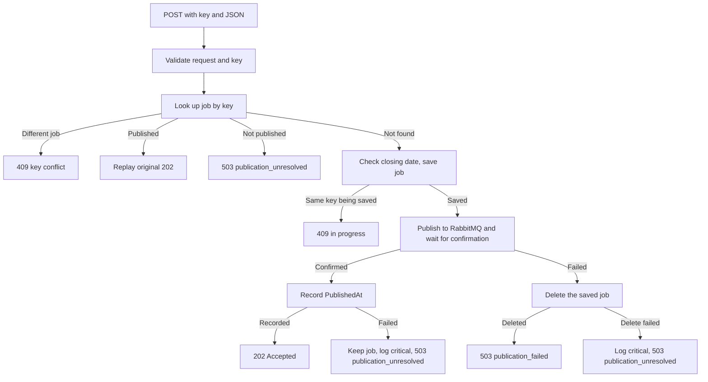

# POST workflow: save, publish, compensate

The API returns `202 Accepted` only when the job is saved and RabbitMQ has confirmed the message. If publishing fails, the API undoes the save. This undo step is called compensation. There is no outbox and no background retry. [DECISIONS.md](../../../../../DECISIONS.md) section 2 explains why. Request and response formats are in the [API contract](api-contract.md).

## Steps

1. **Save.** The API saves the job and commits before it contacts RabbitMQ.
2. **Publish.** It sends one persistent `JobPostingCreated` message. It waits up to 3 seconds for RabbitMQ's confirmation and checks that the message reached a queue. The whole step, including connecting, has an 8-second limit.
3. **Record.** It sets `PublishedAt` on the job and returns `202`.

Only the request that saved the job publishes it. Retries never publish again (see [Idempotency](idempotency.md)).

## When publishing fails

If RabbitMQ rejects the message, does not confirm it in time, or cannot be reached, the API deletes that exact job. The delete has its own 3-second limit and runs even if the client has disconnected.

| What happened | Response | Critical log event |
|---|---|---|
| Delete succeeded | `503 publication_failed`. A retry with the same key starts again. | – |
| Delete failed or timed out | `503 publication_unresolved` | `PostingCleanupFailed` (2001) |
| Message confirmed, but saving `PublishedAt` failed. The job is kept. | `503 publication_unresolved` | `PostingPublicationStateFailed` (2002) |

All of these responses include `Retry-After: 1`. Critical log entries contain the job ID, message ID and trace ID, but no request data.

## Circuit breaker

A circuit breaker stops calling a service that keeps failing, so requests do not each wait for a timeout. The breaker counts calls to RabbitMQ, both publishes and readiness checks. It opens when at least half of them fail within 60 seconds, with at least 3 calls. While it is open, the API does not contact RabbitMQ for 15 seconds. Each new job is saved, deleted again and answered with `503 publication_failed` straight away. The readiness check also reports "not ready" during this time. These settings are in the `Resilience` section of `appsettings.json`.

## Shutdown

When the API stops, it finishes requests already in progress for up to 30 seconds. New requests get `503`. A cleanup delete that runs during shutdown gets at most the time left in those 30 seconds.

## Known weak spots

Compensation cannot undo every failure:

- **Lost confirmation.** RabbitMQ may store the message, but the confirmation may not arrive in time. The API then deletes the job, while the message stays in the queue. If the delete succeeds, the API logs an ordinary error (event 1001), not a critical event. Search still adds the deleted job. A retry creates the job again with a new ID, so search may show it twice.
- **Crash after save.** If the process stops after saving but before publishing, the job stays unpublished. Search never receives it, and nothing is logged. Retries with the same key return `503 publication_unresolved`.
- **Unknown delete result.** If the delete fails in an unclear way, the job may or may not still exist.
- **RabbitMQ down.** Nobody can post a job until RabbitMQ is back.

There is no automatic repair for these cases. A person must check the job by hand, using the IDs in the critical log entry. DECISIONS.md section 2 lists the safeguards that would be added in production.
