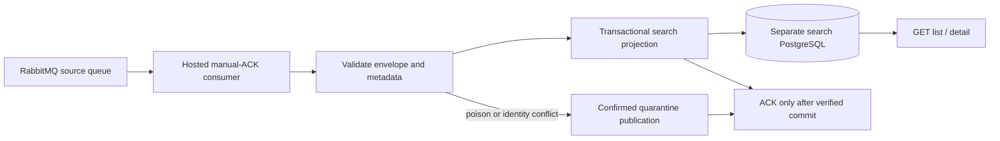

# Independent search API design

The .NET 10 application owns its PostgreSQL database, migrations, contracts and tests. It has no posting project/source/HTTP/database dependency. RabbitMQ wire compatibility is the integration boundary, using local versioned event types and a frozen fixture.

Projection uses source job/event IDs and a versioned canonical fingerprint to make redelivery a no-op. Conflicting identity/content is quarantined. A transaction advisory lock orders ingestion sequence allocation through commit, making the pagination watermark safe under concurrent writes. No separate ledger, inbox or outbox is used. Distinct recreated IDs with identical content are separate jobs; this service cannot repair upstream compensation/recreation or broker data loss.

Unknown database commit outcomes are resolved by a fresh durable read where possible; otherwise the delivery remains unacknowledged. Quarantine publication requires broker confirmation before source ACK. Failed or unknown quarantine outcomes retain the source delivery; quarantine duplicates remain possible. ACK tags belong to their original channel and are never reused after reconnect.

Read queries use PostgreSQL keyset pagination, bounded projections and limit+1, with B-tree ordering indexes and pg_trgm substring indexes. HMAC cursors bind query, day, watermark and lifetime. Central exception handling and safe structured logging avoid exposing payloads or production exception detail. Consumer admission, drain and cleanup are bounded; read readiness is independent of ingestion health.

See [contracts](contracts.md), [persistence](persistence.md), [messaging lifecycle](messaging.md), [search semantics](search.md), and [measured performance](performance/read-performance.md) for implementation details and tradeoffs.
